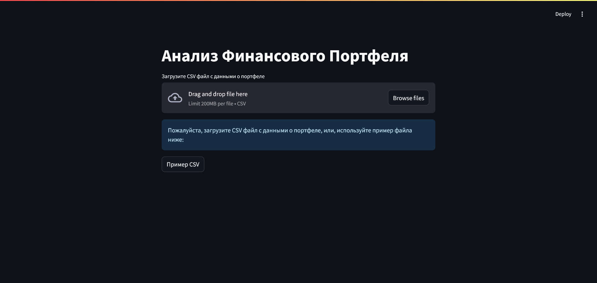
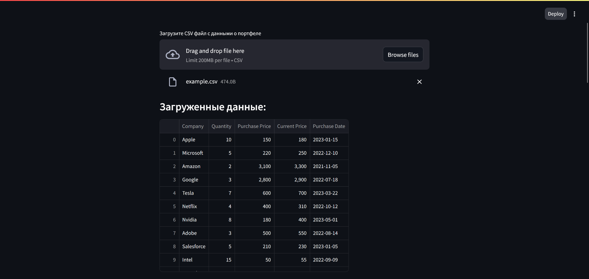
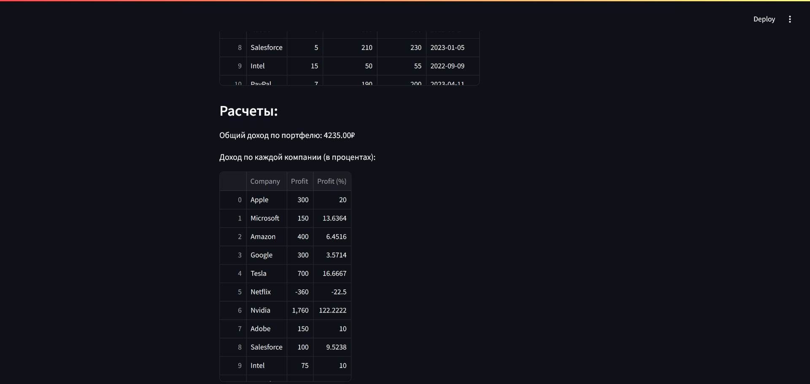
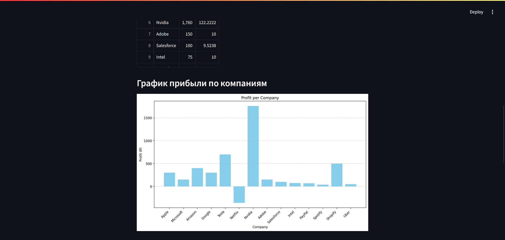
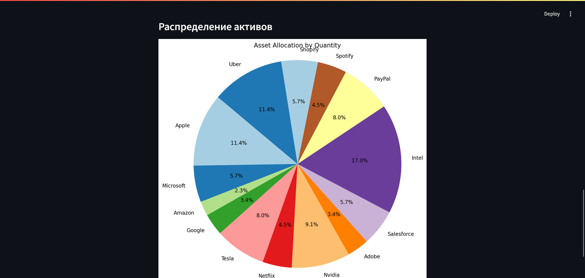

# Анализ Финансового Портфеля - Streamlit

## Описание проекта

Проект визуализирует:
* Загруженные данные (обработка через `pandas`)
* Общий доход по портфелю (в рублях)
* Доход по каждой компании (в %)
* График прибыли по компаниям (обработка через `matplotlib.pyplot.bar`)
* Распределение активов (обработка через `matplotlib.pyplot.pie`)

Установка:
```console
pip install streamlit pandas matplotlib
```

Запуск:
```console
streamlit run main.py
```

Пример:





